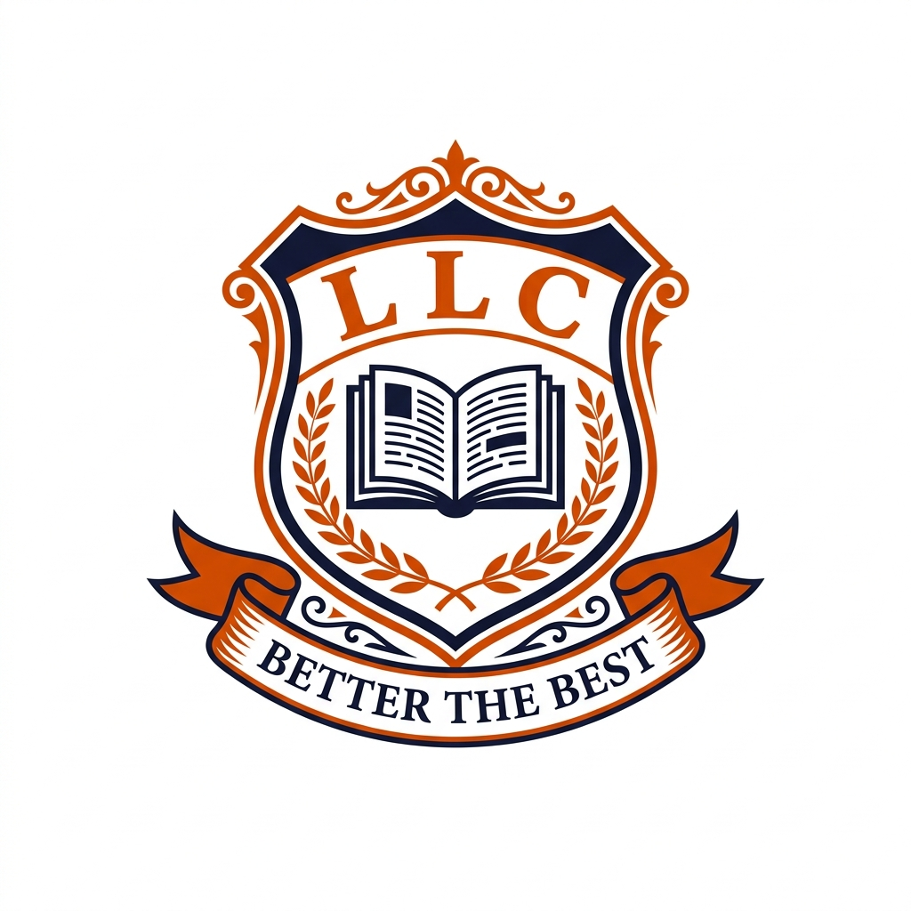

<p align="center">
  
</p>

<h1 align="center">🏫 Lynpark Learning Centre</h1>

<p align="center">
  <em>"Better The Best"</em>
</p>

<p align="center">
  <strong>Official website for Lynpark Learning Centre — Magwagwa Branch, Nyamira, Kenya</strong>
</p>

<p align="center">
  <a href="#-features">Features</a> •
  <a href="#-pages">Pages</a> •
  <a href="#-tech-stack">Tech Stack</a> •
  <a href="#-getting-started">Getting Started</a> •
  <a href="#-project-structure">Structure</a> •
  <a href="#-contributing">Contributing</a>
</p>

---

## 📖 About

Lynpark Learning Centre is a **registered Ministry of Education primary school** located in Magwagwa, Nyamira County, Kenya. The school offers the **Competency-Based Curriculum (CBC)** from Pre-Primary (PP1) through Junior Secondary (Grade 8).

This repository contains the school's official marketing website — a fully responsive, static site built with vanilla HTML, CSS, and JavaScript.

---

## ✨ Features

| Feature | Description |
|---------|-------------|
| 🎨 **Deep Orange & Navy Design** | Premium color palette with Kenya-flag accent stripe |
| 📱 **Fully Responsive** | Mobile-first design with hamburger nav, touch-friendly controls |
| 🖼️ **Photo Gallery** | Filterable gallery with lightbox, keyboard nav, and swipe support |
| 🎠 **Hero Slider** | Animated homepage slider with autoplay, arrows, dots, and swipe |
| 📬 **Contact Form** | Client-side validated form with toast notifications |
| 🎭 **Scroll Animations** | Intersection Observer-powered reveal animations |
| ⚡ **Fast & Lightweight** | No frameworks, no build tools — pure vanilla HTML/CSS/JS |
| 🏳️ **Kenya Heritage** | Flag-colored stripe, localized content, and Kenyan identity |

---

## 📄 Pages

| Page | File | Description |
|------|------|-------------|
| 🏠 **Home** | `index.html` | Hero slider, welcome section, stats, programs overview, news preview |
| ℹ️ **About** | `about.html` | School history, mission & vision, core values |
| 📚 **Academics** | `academics.html` | CBC curriculum breakdown (PP1 → Grade 8), program cards |
| 🎓 **Admissions** | `admissions.html` | Enrollment process, requirements, admission timeline |
| 👨‍🏫 **Staff** | `staff.html` | Leadership team, teaching staff showcase with real photos |
| 🖼️ **Gallery** | `gallery.html` | Filterable photo gallery (Campus, Sports, Events, Staff) |
| 📰 **News** | `news.html` | School news and announcements |
| 📅 **Events** | `events.html` | Upcoming and past school events |
| 📞 **Contact** | `contact.html` | Contact form, phone numbers, email, Google Maps embed |

---

## 🛠️ Tech Stack

| Category | Technology |
|----------|-----------|
| **Structure** | HTML5 (semantic) |
| **Styling** | Vanilla CSS with CSS Custom Properties (design tokens) |
| **Logic** | Vanilla JavaScript (ES6+) |
| **Icons** | [Font Awesome 6](https://fontawesome.com/) |
| **Fonts** | [Google Fonts](https://fonts.google.com/) — Montserrat + PT Serif |
| **Hosting** | [GitHub Pages](https://pages.github.com/) |

> **No frameworks. No build tools. No npm dependencies.** Just clean, maintainable, hand-crafted code.

---

## 🚀 Getting Started

### Prerequisites

- A modern web browser (Chrome, Firefox, Safari, Edge)
- [Git](https://git-scm.com/) for cloning

### Clone & Run Locally

```bash
# Clone the repository
git clone https://github.com/csia77/Lynpark_Academy_App.git

# Navigate into the project
cd Lynpark_Academy_App

# Option 1: Open directly in browser
# Just open index.html in your browser

# Option 2: Use a local server (recommended)
npx serve . -p 3000

# Then visit http://localhost:3000
```

### Deploy to GitHub Pages

1. Go to **Settings → Pages** in your GitHub repo
2. Set **Source** to `Branch: main`, folder `/ (root)`
3. Click **Save**
4. Your site will be live at: `https://csia77.github.io/Lynpark_Academy_App/`

---

## 📁 Project Structure

```
Lynpark_Academy_App/
│
├── index.html              # Homepage
├── about.html              # About page
├── academics.html          # Academics page
├── admissions.html         # Admissions page
├── staff.html              # Staff page
├── gallery.html            # Photo gallery
├── news.html               # News page
├── events.html             # Events page
├── contact.html            # Contact page
│
├── css/
│   ├── variables.css       # 🎨 Design tokens (colors, fonts, spacing)
│   ├── base.css            # 📐 Reset, typography, global styles
│   ├── layout.css          # 📏 Grid, flex, spacing utilities
│   ├── components.css      # 🧩 Buttons, cards, navbar, hero, footer
│   ├── animations.css      # ✨ Scroll-triggered animations
│   └── responsive.css      # 📱 Mobile/tablet breakpoints
│
├── js/
│   ├── main.js             # 🔧 Nav, scroll handler, back-to-top
│   ├── slider.js           # 🎠 Hero slider logic
│   ├── animations.js       # 🎬 Intersection Observer animations
│   ├── gallery.js          # 🖼️ Gallery filter + lightbox
│   └── contact-form.js     # 📬 Form validation + submit
│
└── assets/
    └── images/
        ├── logo.png        # School logo
        ├── hero/           # Hero slider background images
        ├── students/       # Student & campus photos
        └── staff/          # Teacher & leadership photos
```

---

## 🎨 Design System

The site uses a **CSS Custom Properties-based design system** defined in `css/variables.css`:

### Color Palette

| Token | Color | Usage |
|-------|-------|-------|
| `--primary` | `#E65100` 🟠 | Primary deep orange |
| `--primary-light` | `#FF8A65` | Hover states, accents |
| `--primary-dark` | `#BF360C` | Active states |
| `--secondary-dark` | `#1A1A2E` 🔵 | Navy backgrounds |
| `--secondary` | `#16213E` | Darker navy variant |
| `--kenya-red` | `#BB1600` 🔴 | Flag stripe |
| `--kenya-green` | `#006B3F` 🟢 | Flag stripe |

### Typography

- **Headings:** PT Serif (serif)
- **Body:** Montserrat (sans-serif)
- **Sizes:** Responsive `clamp()` values from `--text-xs` to `--text-5xl`

---

## 📞 Contact Information

| Channel | Detail |
|---------|--------|
| 📍 **Address** | P.O. Box 669, Nyamira, Kenya |
| 📍 **Branch** | Magwagwa Branch |
| 📞 **Phone 1** | +254 727 445 820 |
| 📞 **Phone 2** | +254 702 363 408 |
| 📞 **Phone 3** | +254 746 138 262 |
| 📧 **Email** | le_centre@yahoo.com |

---

## 🤝 Contributing

Contributions are welcome! If you'd like to help improve the school website:

1. **Fork** the repository
2. **Create** a feature branch (`git checkout -b feature/your-feature`)
3. **Commit** your changes (`git commit -m 'Add your feature'`)
4. **Push** to the branch (`git push origin feature/your-feature`)
5. **Open** a Pull Request

### Development Guidelines

- Keep it **vanilla** — no frameworks or build tools
- Follow the existing **CSS naming conventions** and design tokens
- Test on **mobile devices** before submitting
- Maintain **accessibility** best practices

---

## 📜 License

This project is proprietary to **Lynpark Learning Centre**. All rights reserved.

School photos and branding are © Lynpark Learning Centre, Nyamira, Kenya.

---

<p align="center">
  Made with ❤️ for <strong>Lynpark Learning Centre</strong>
  <br>
  <em>Magwagwa, Nyamira County, Kenya 🇰🇪</em>
</p>
